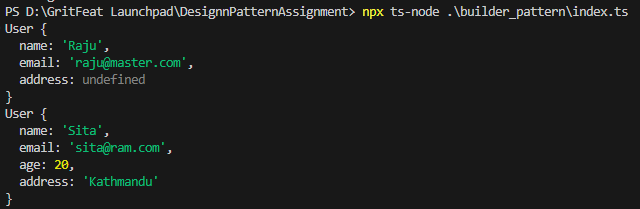

# Builder Pattern Implementation

## Purpose
Construct complex objects step by step, allowing different representations.

## Implementation
- User class with required and optional parameters
- UserBuilder class with fluent interface
- Build method returns the final User object

## Usage
```typescript
const user = new UserBuilder('name', 'email')
  .setAge(25)
  .setAddress('address')
  .build();
```
## Output
