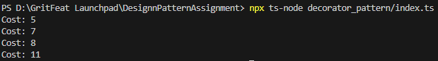

# Decorator Pattern Implementation

## Purpose
Add responsibilities to objects dynamically.

## Implementation
- Component interface (Coffee) defines common operations
- Concrete component (SimpleCoffee) implements basic behavior
- Decorator classes wrap components and add functionality

## Usage
```typescript
let coffee = new SimpleCoffee();
coffee = new MilkDecorator(coffee);

