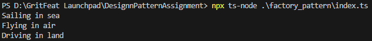

# Factory Pattern Implementation

## Purpose
Creates objects without exposing the instantiation logic to the client.

## Implementation
- Transport interface defines common operations
- Concrete transport classes implement the interface
- Factory class with static method to create instances based on input

## Usage
```typescript
const transport = LogisticsFactory.createTransport('sea');
transport.deliver();
```
## Output
