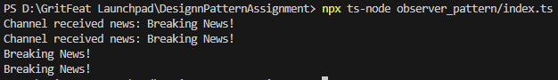

# Observer Pattern Implementation

## Purpose
Define a subscription mechanism to notify multiple objects about events.

## Implementation
- Subject (NewsAgency) maintains list of observers
- Observers (NewsChannel) implement update method
- Subject notifies observers when state changes

## Usage
```typescript
agency.addChannel(channel);
agency.publishNews('news');
```
## Output
