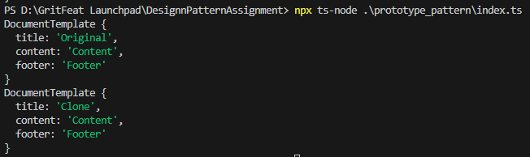

# Prototype Pattern Implementation

## Purpose
Create new objects by copying an existing object (prototype).

## Implementation
- DocumentTemplate class with clone method
- Shallow copy using object spread or constructor
- Client code can create copies without knowing concrete classes

## Usage
```typescript
const copy = original.clone();
```
## Output
