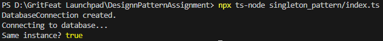

# Singleton Pattern Implementation

## Purpose
Ensures a class has only one instance and provides a global point of access to it.

## Implementation
- Private constructor to prevent direct construction calls
- Static method `getInstance()` that controls the access to the singleton instance
- Lazy initialization (instance created only when needed)

## Usage
```typescript
const connection = DatabaseConnection.getInstance();


