# MONGODB ASSIGNMENT-1
## Inserting data
```
use user

db.users.insertMany([
{
    username: "alex_p",
    email: "alex.p@example.com",
    age: 28,
    country: "USA",
    last_login: ISODate("2023-10-25T10:00:00Z"),
    followers: 1200,
    interests: ["programming", "hiking", "music"],
    profile: { theme: "dark", bio: "Software developer and nature enthusiast." },
    devices: [
        { type: "mobile", os: "Android", last_seen: ISODate("2023-10-25T09:55:00Z") },
        { type: "desktop", os: "Windows", last_seen: ISODate("2023-10-24T15:30:00Z") }
    ]
},
{
    username: "jane_doe",
    email: "jane.d@workplace.com",
    age: 34,
    country: "Canada",
    last_login: ISODate("2023-11-01T12:30:00Z"),
    followers: 850,
    interests: ["travel", "photography", "music"],
    profile: { theme: "light" },
    subscription: { tier: "premium", start_date: ISODate("2023-01-01T00:00:00Z") }
},
{
    username: "sam_g",
    email: "sam.g@example.com",
    age: 22,
    country: "UK",
    last_login: ISODate("2023-09-15T18:45:00Z"),
    followers: 2500,
    interests: ["gaming", "streaming"],
    profile: { theme: "dark", bio: "Pro gamer and streamer." },
    devices: [
        { type: "desktop", os: "Windows", last_seen: ISODate("2023-09-15T18:40:00Z") }
    ]
},
{
    username: "chris_b",
    email: "chris.b@inbox.com",
    age: 45,
    country: "Australia",
    last_login: ISODate("2023-10-30T05:00:00Z"),
    followers: 50,
    interests: ["gardening", "cooking"],
    profile: { theme: "light", bio: "Loves the outdoors." }
},
{
    username: "maria_s",
    email: "maria.s@example.com",
    age: 31,
    country: "Germany",
    last_login: ISODate("2023-11-02T20:00:00Z"),
    followers: 1800,
    interests: ["art", "history", "travel"],
    profile: { theme: "dark", bio: "Museum curator." },
    subscription: { tier: "premium", start_date: ISODate("2022-06-15T00:00:00Z") }
},
{
    username: "another_user",
    email: "another@example.com",
    age: 29,
    country: "USA",
    followers: 95,
    interests: ["music", "programming"],
    profile: "Profile setup pending"
}
])
```
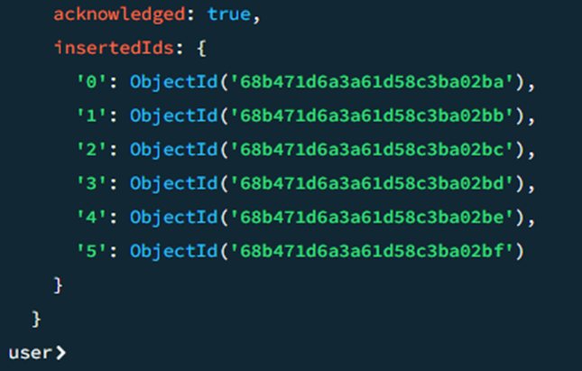
## Questions
### 1.	Find users older than 30, but only show their username and country.
```
db.users.find({ age: { $gt: 30 } }, { username: 1, country:1, _id:0 })
```
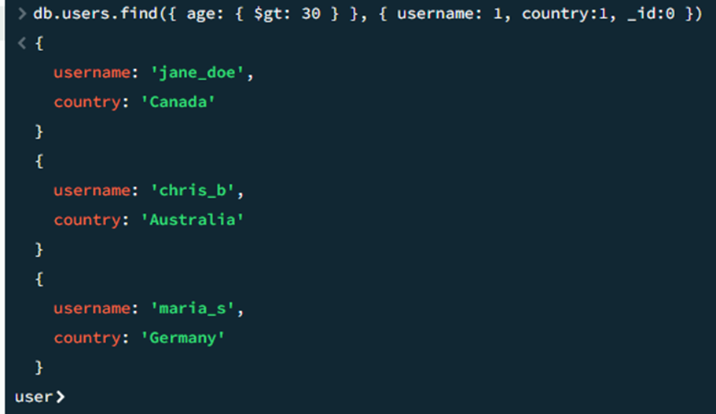
 
### 2.	Find users whose follower count is less than or equal to 100.
```
db.users.find({ followers: { $lte: 100 } })
```
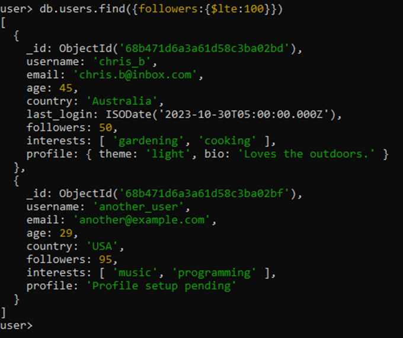
### 3.	Find all users from 'USA' or 'Canada'.
```
db.users.find({ country: { $in: ["USA", "Canada"] } })
```
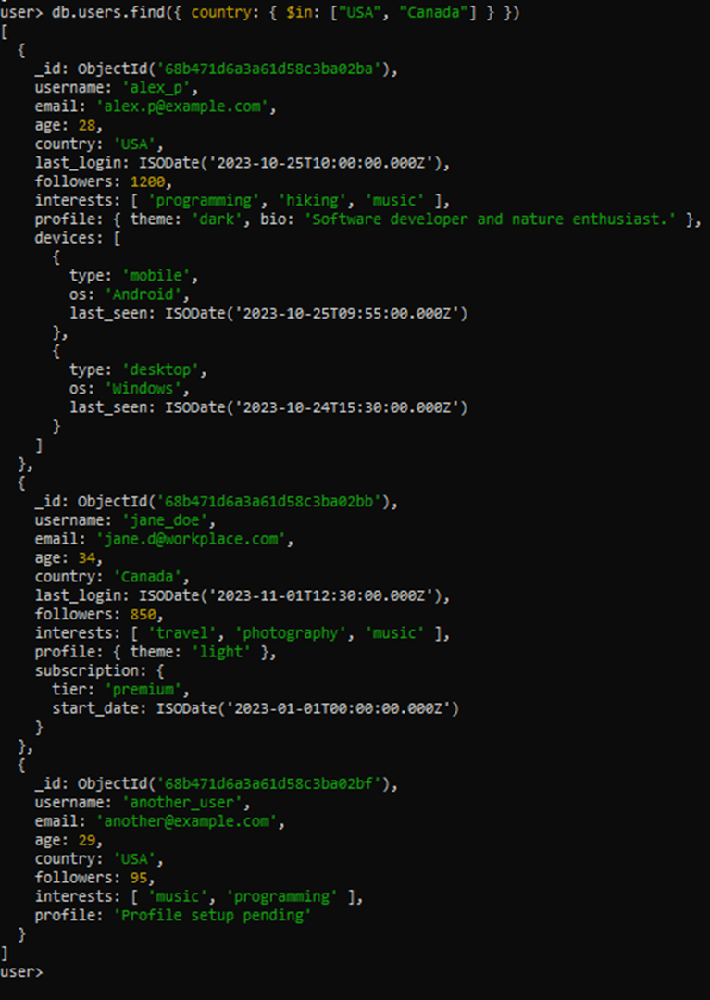
### 4.	Find all users who are NOT from 'USA' or the 'UK'.
```
db.users.find({ country: { $nin: ["USA", "UK"] } })
```
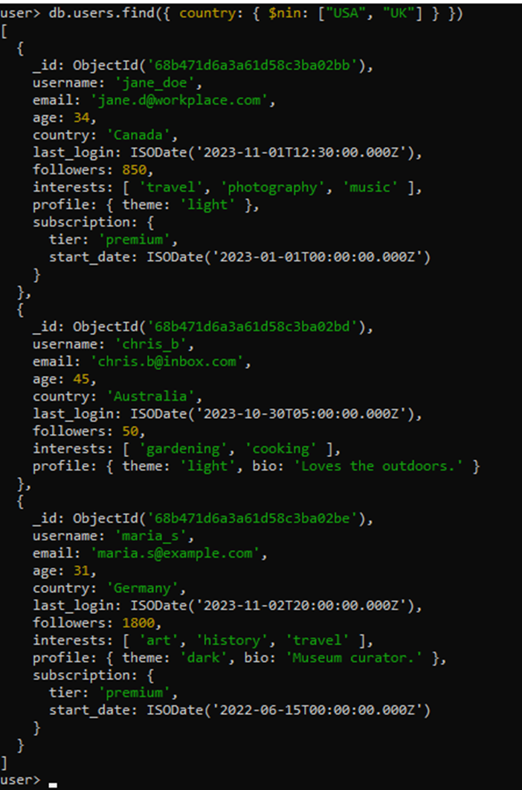
### 5.	Find users who are from the 'USA' AND have more than 1000 followers.
```
db.users.find({ country: "USA",  followers: { $gt: 1000 } })
```
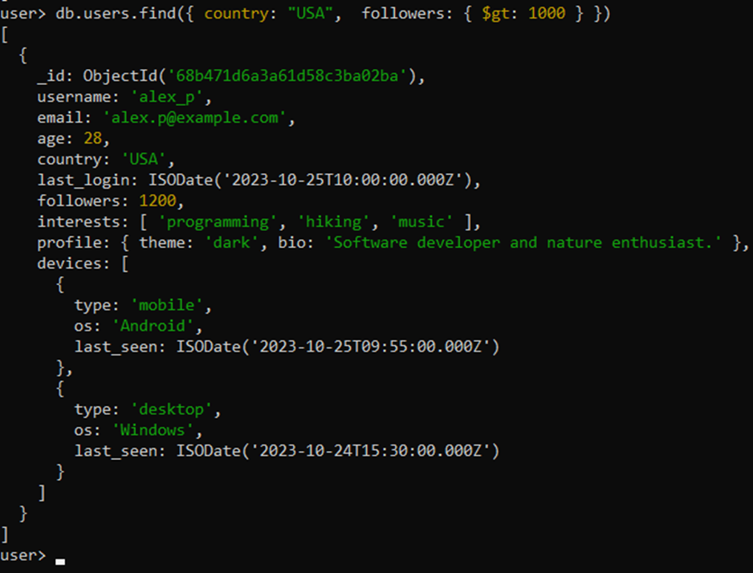 
### 6.	Find users who have more than 2000 followers OR are from 'Australia'.
```
db.users.find({$or: [{ followers: { $gt: 2000 } },{ country: "Australia" }]})
```
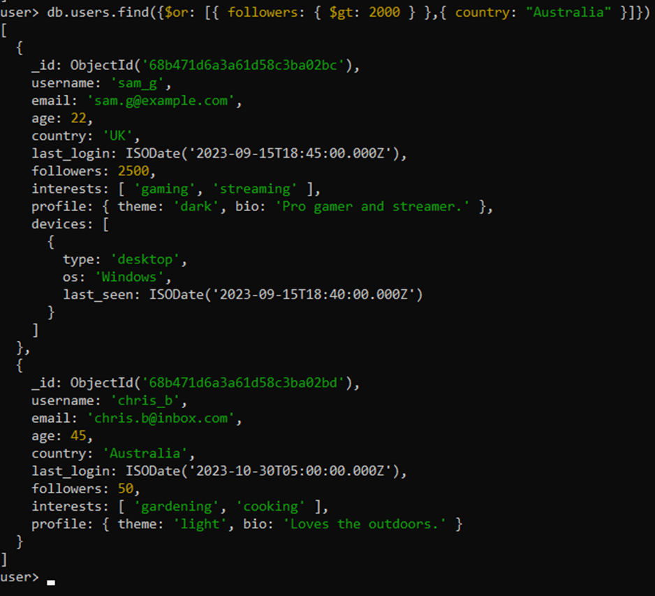
### 7.	Find all users who have a subscription field.
```
db.users.find({ subscription: { $exists: true } })
```
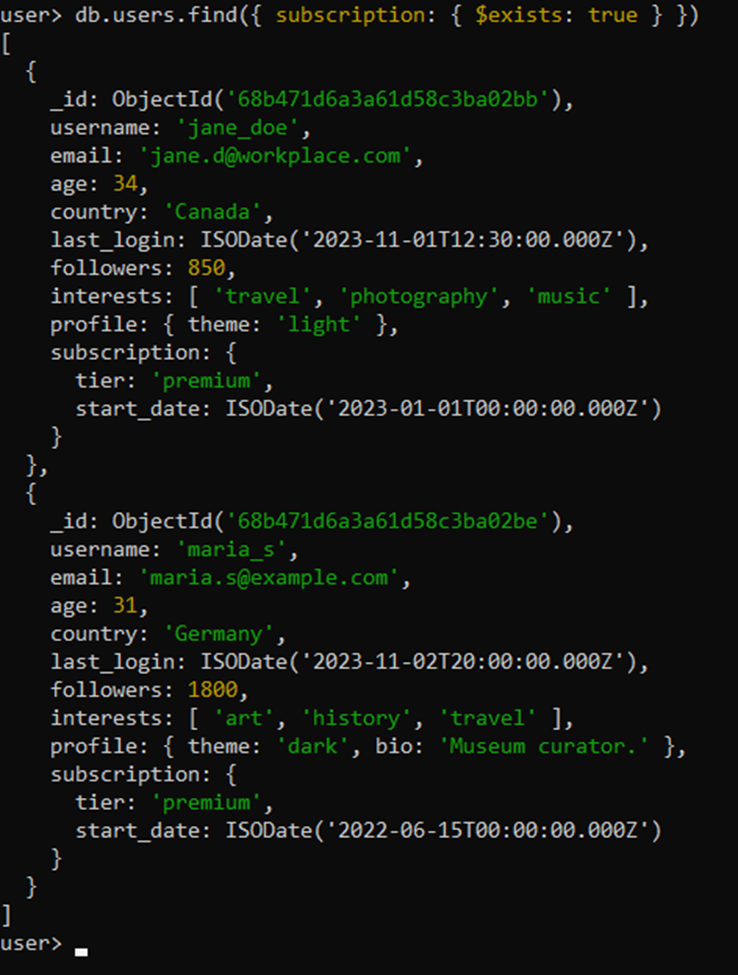
### 8.	Find users whose profile field is a string, not an embedded document.
```
db.users.find({ profile: { $type: "string" } })
```
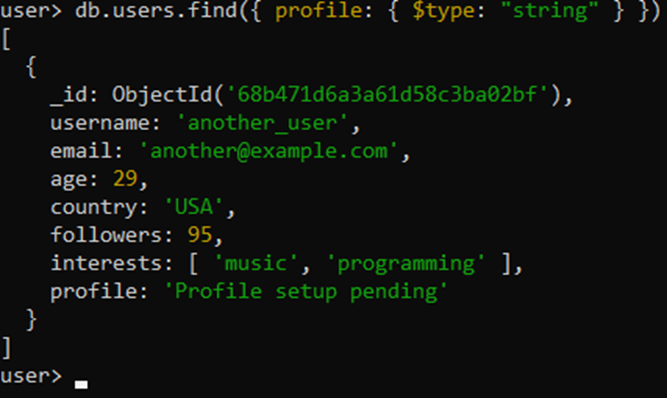
### 9.	Find users who are interested in both 'travel' AND 'music'.
```
db.users.find({interests: { $all: ["travel", "music"] }})
```
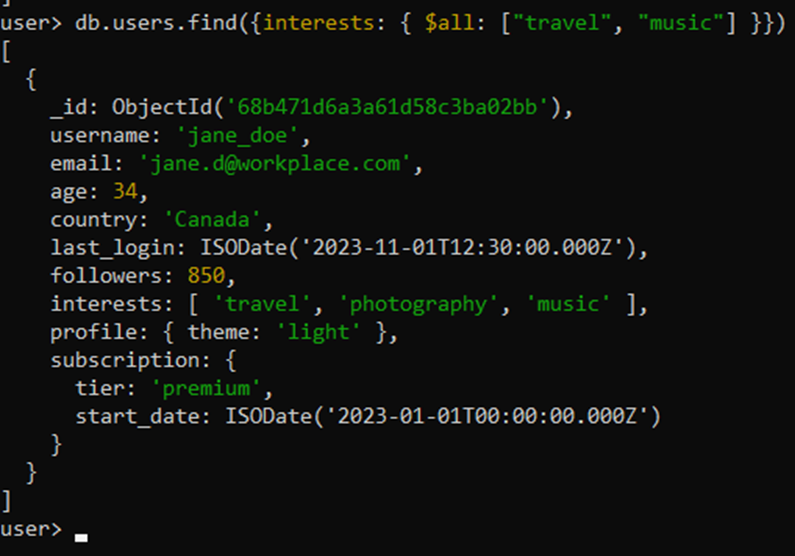
### 10.	Find users who have used a 'mobile' device since October 1st, 2023.
```
db.users.find({"devices.type": "mobile", "devices.last_seen": { $gte: ISODate("2023-10-01T00:00:00Z") }})
```
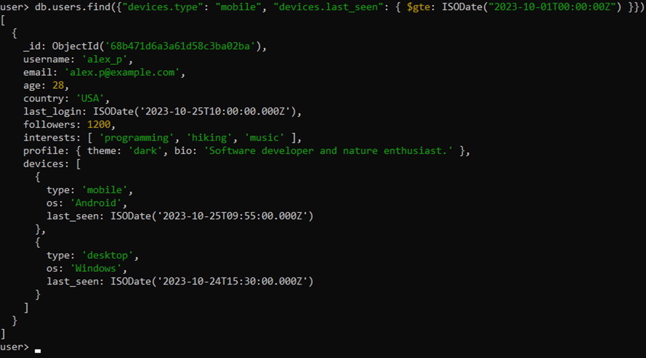 
### 11.	Find all users whose email address ends with 'workplace.com'.
```
db.users.find({ email: /workplace\.com$/ })
```
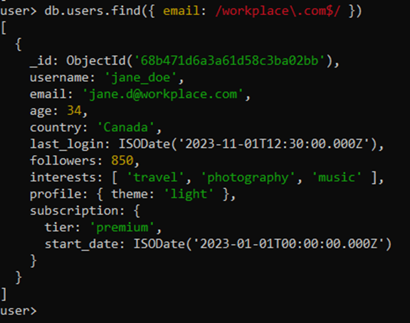
### 12.	For user sam_g, add 50 followers and add a new interest 'coding'.
```
db.users.updateOne({ username: "sam_g" }, { $inc: { followers: 50 }, $push: { interests: "coding" }});
```
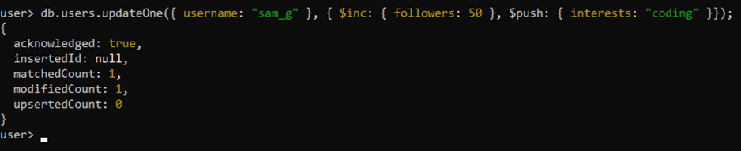
### 13.	For all users from the 'USA', rename the followers field to follower_count.
```
db.users.updateMany({ country: "USA" }, { $rename: { "followers": "follower_count" } })
```
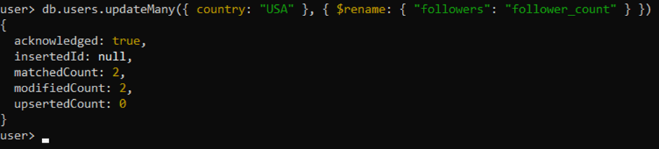
### 14.	Attempt to update user new_user; if they don't exist, insert them with default data.
```
db.users.updateOne(
    { username: "new_user" },
    {
        $setOnInsert: {
            username: "new_user",
            email: "new@example.com",
            age: 25,
            country: "Unknown",
            followers: 0,
            interests: [],
            profile: "Default profile"
        }
    },
    { upsert: true }
)
```
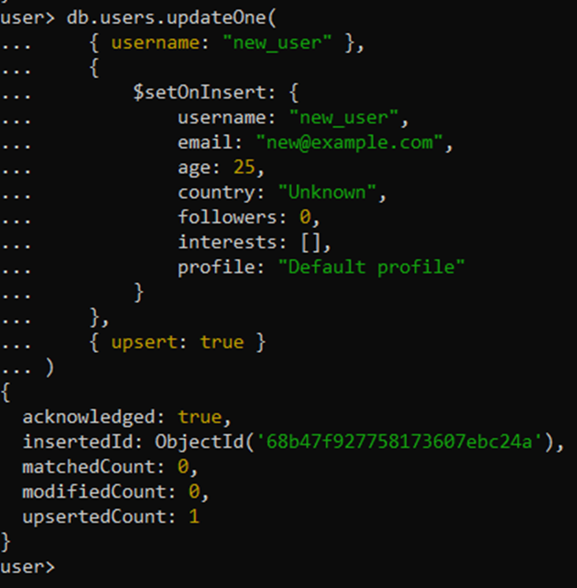

### 15.	Delete all users who have not logged in (hint: the last_login field does not exist).
```
db.users.deleteMany({ last_login: { $exists: false } })
```
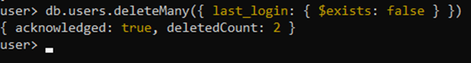
### 16.	Find users from the 'USA' who are either younger than 25 OR have more than 1500 followers.
```
db.users.find({country: "USA",$or: [{ age: { $lt: 25 } },{ followers: { $gt: 1500 }}]})
```
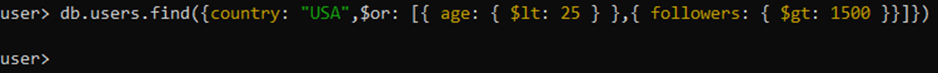
### 17.	Find all users who have a 'desktop' device that runs 'Windows'.
```
db.users.find({ "devices": { $elemMatch: { type: "desktop", os: "Windows" }}})
```
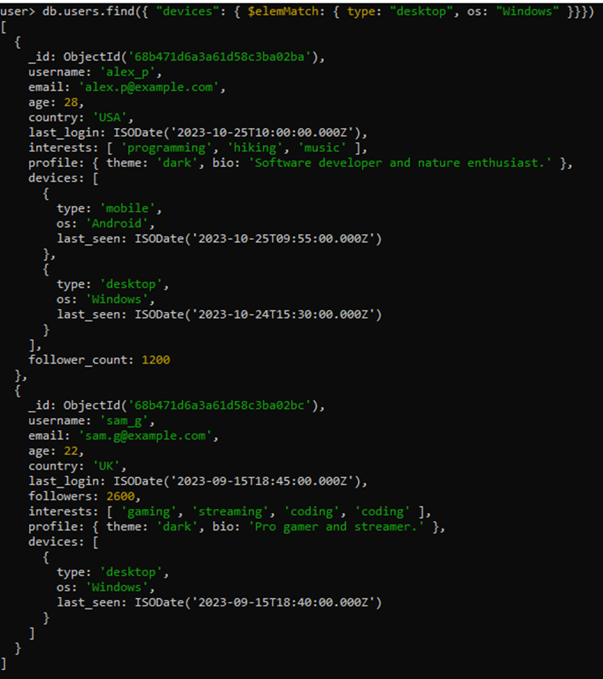
### 18.	Update all users with a 'dark' theme profile by adding a pro_user: true flag.
```
db.users.updateMany( { "profile.theme": "dark" }, { $set: { pro_user: true }})
```
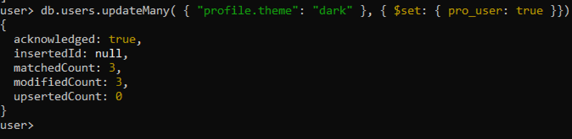