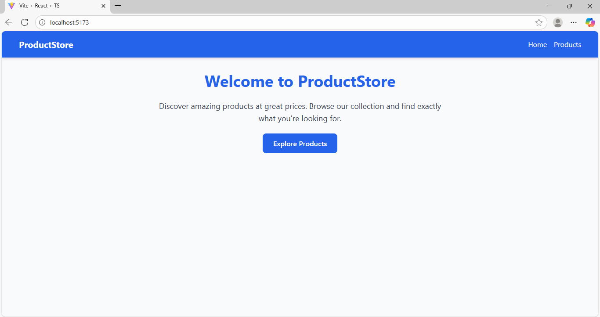
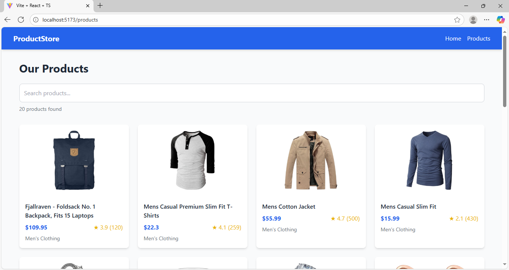
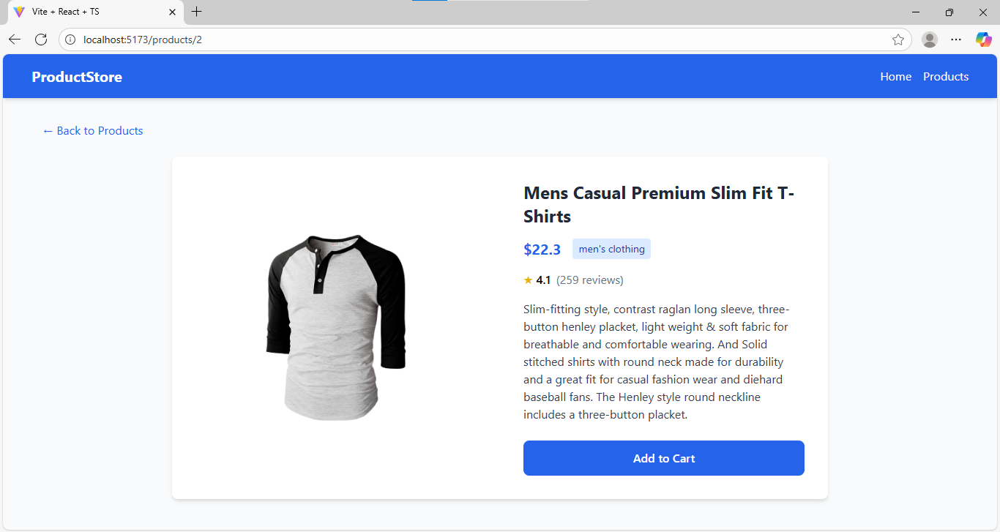

# Product Listing App with Search & Routing
A React application that displays products with search functionality and routing using React Router.
## Features
- Home Page: Welcome message with navigation to products
- Products Page: Product listing with real-time search filtering
- Product Details Page: Detailed view of individual products
- Search Functionality: Filter products by name as you type
- Responsive Design: Works on desktop and mobile devices
- Error Handling: Proper handling of API errors and missing products
## Technologies Used
- React 18 with TypeScript
- React Router DOM for navigation
- Tailwind CSS for styling
- Fake Store API for product data
## Prerequisites
- Node.js (version 14 or higher)
- npm or yarn package manager
## Installation
1. Clone the repository:
```
git clone https://github.com/pujan-22/GritFeat-Launchpad/tree/main/product-listing-app
cd product-listing-app
```
2. Install dependencies:
```
npm install
```
## Running the Application
Start the development server:
```
npm run dev
```
Open your browser and navigate to http://localhost:5173 to view the application.
## Project Structure
```
src/
  components/
    Navbar.tsx          # Navigation component
  pages/
    Home.tsx            # Home page component
    Products.tsx        # Products listing page with search
    ProductDetails.tsx  # Individual product details page
  types/
    Product.ts          # TypeScript interfaces
  App.tsx               # Main app component with routing
  main.tsx              # Application entry point
```
## API Reference
This application uses the Fake Store API to fetch product data:

  - GET https://fakestoreapi.com/products - Fetch all products
  - GET https://fakestoreapi.com/products/:id - Fetch single product
## Screenshots


