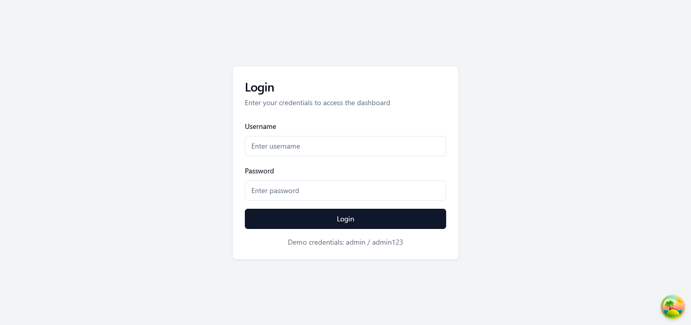
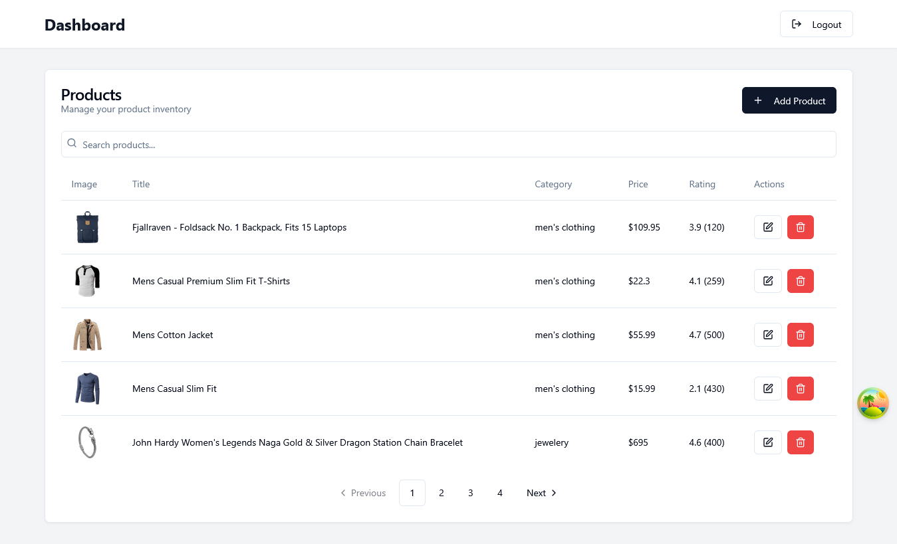
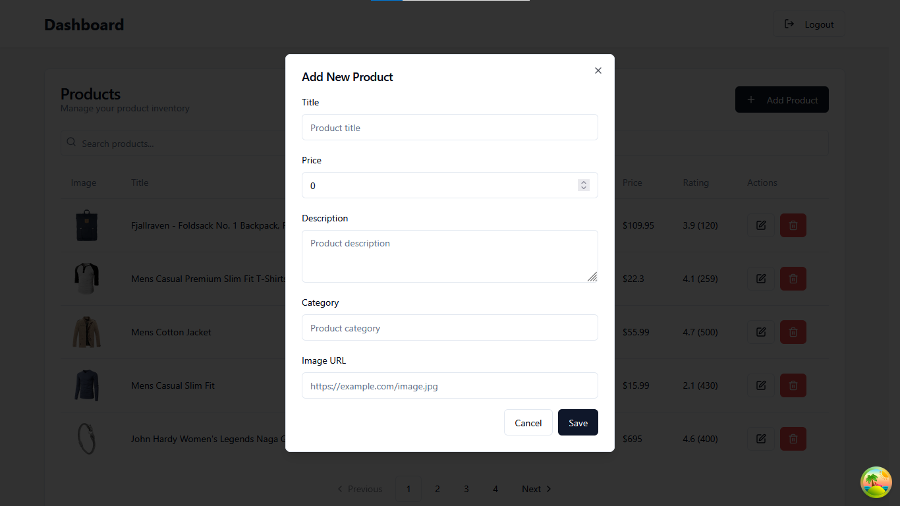
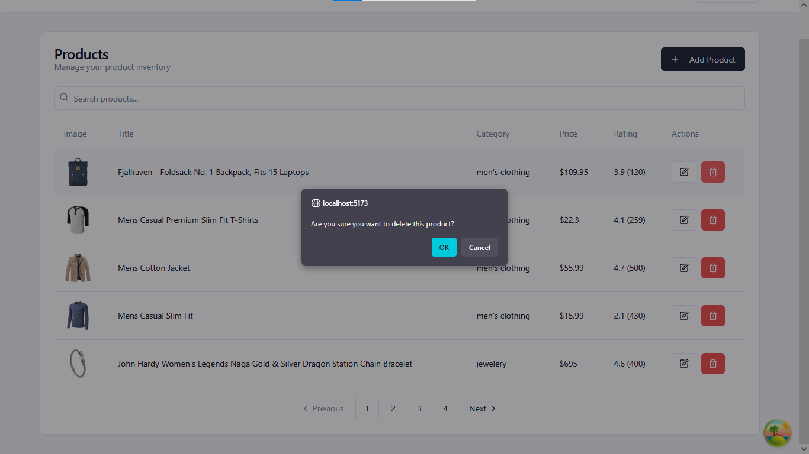

# React CRUD App with Authentication
A complete React application with user authentication and full CRUD (Create, Read, Update, Delete) operations for product management.
## Features
### Authentication
  - Login system with hardcoded credentials (admin/admin123)
  - Protected routes that require authentication
  - Session management with React Context

### Product Management (CRUD)
  - Create: Add new products with form validation
  - Read: View product list with search and pagination
  - Update: Edit existing product information
  - Delete: Remove products with confirmation

### UI/UX Features
  - Modern, responsive design with ShadCN components
  - Real-time search and filtering
  - Pagination for better data management
  - Loading states and skeleton screens
  - Error handling with user-friendly messages
  - Form validation with Zod schema validation

## Tech Stack
  - Frontend: React 18 + TypeScript
  - UI Components: ShadCN UI
  - State Management: TanStack Query (React Query)
  - Routing: React Router v6
  - Form Handling: React Hook Form + Zod validation
  - HTTP Client: Native Fetch API
  - Styling: Tailwind CSS
  - Build Tool: Vite

## Installation
- Clone Repository
```
git clone https://github.com/pujan-22/GritFeat-Launchpad/tree/main/react-crud-app
cd react-crud-app
```
Install dependencies
```
npm install
```
Start the development server
```
npm run dev
```
Open your browser Navigate to http://localhost:5173

 Login Credentials

    Username: admin
    Password: admin123

## Usage
1. Login
    - Access the login page at /login
    - Enter the credentials mentioned above
    - Successful login redirects to the dashboard

2. Dashboard Features
    - View Products: See all products in a paginated table
    - Search: Use the search bar to filter products by title or category
    - Add Product: Click "Add Product" button to create new products
    - Edit Product: Click the edit icon on any product row
    - Delete Product: Click the delete icon (trash can) on any product row

3. Product Form
    - Title: Product name (required)
    - Price: Product price (required, must be > 0)
    - Description: Product description (required)
    - Category: Product category (required
    - Image URL: Product image URL (required, must be valid URL)

## API Integration
This app uses the Fake Store API for product data:
  - GET /products - Fetch all products
  - GET /products/:id - Fetch single product
  - POST /products - Create new product
  - PUT /products/:id - Update product
  - DELETE /products/:id - Delete product


## Screenshots






