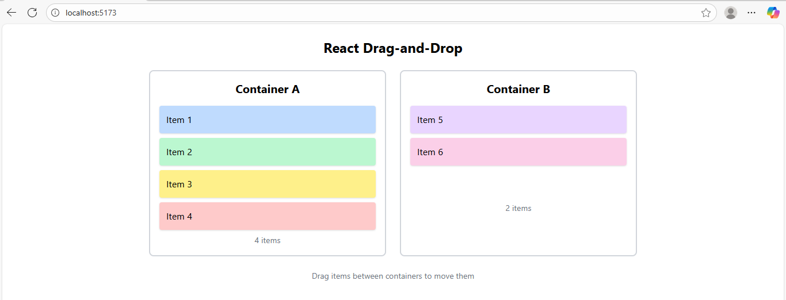
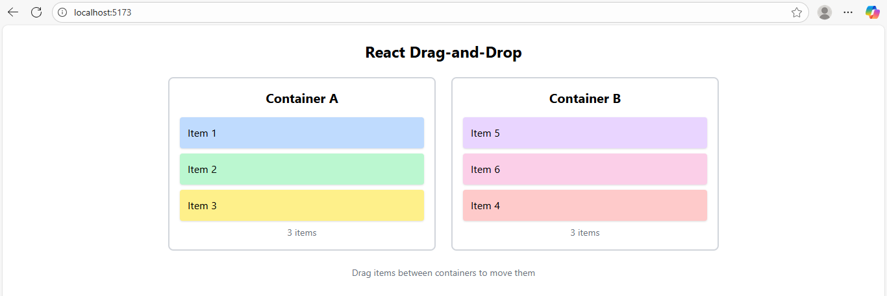

# React Drag-and-Drop Assignment

A React application that demonstrates drag-and-drop functionality between two containers, built with Vite, TypeScript, and Tailwind CSS.

## Features

- Drag items between two containers
- Visual feedback during dragging (opacity change and scaling)
- Container highlighting when an item is dragged over
- Distinct visual styling for different items
- Responsive design with Tailwind CSS
- TypeScript for type safety

## Technologies Used

- React 18
- TypeScript
- Vite
- Tailwind CSS

## Prerequisites

- Node.js (version 14 or higher)
- npm or yarn

## Installation and Setup

1. Clone the repository:
```bash
git clone https://github.com/pujan-22/GritFeat-Launchpad/tree/main/react-drag-and-drop
cd react-drag-and-drop
```
2. Install Dependencies:
```
npm install
```
3. Start the development server:
```
npm run dev
```
4. Open your browser and navigate to http://localhost:5173


## Output
Before


After
