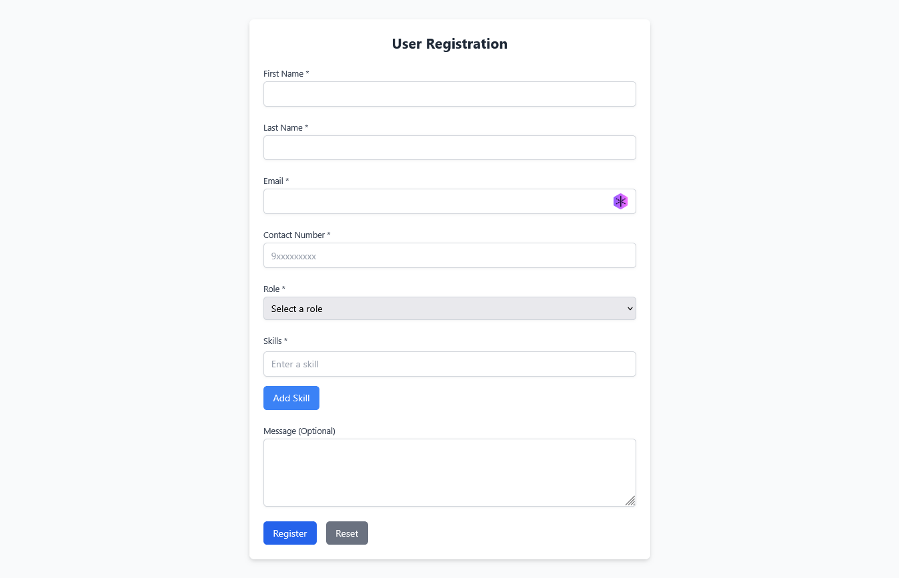
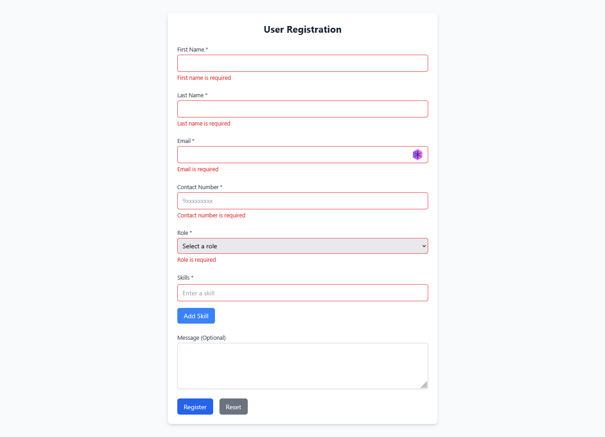
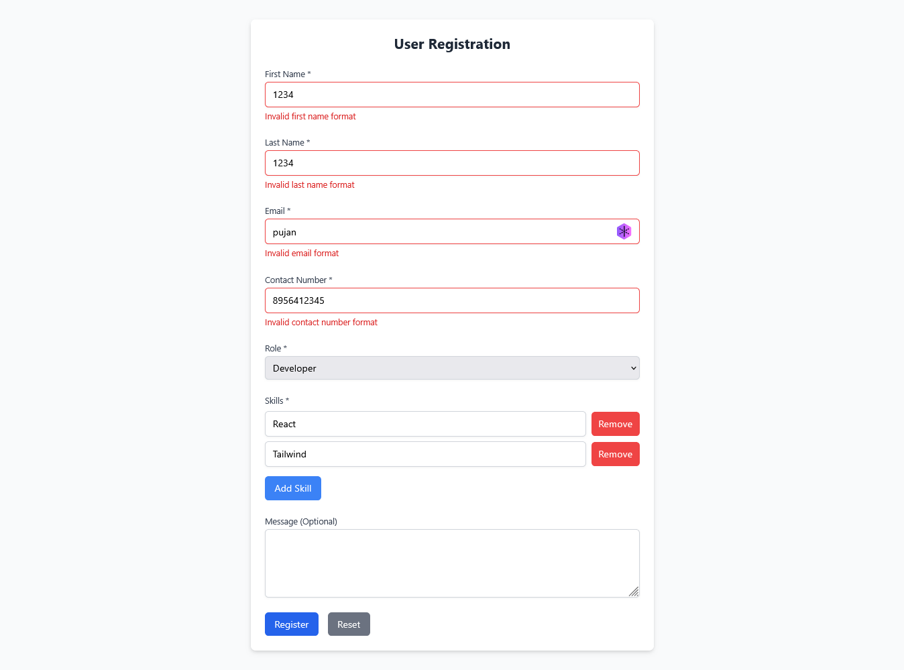
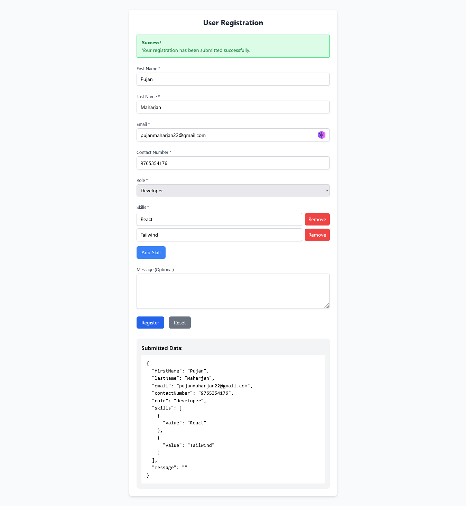

# User Registration Form
A React-based user registration form with comprehensive validation using React Hook Form and Zod.
## Features
  - Form Validation: Comprehensive validation for all fields using Zod schema validation
  - Dynamic Fields: Add or remove skills dynamically with field array functionality
  - Real-time Feedback: Instant validation messages as users type
  - Responsive Design: Clean, modern UI that works on all device sizes
  - Form Reset: Easy form reset functionality
  - Submission Preview: Display of submitted data upon successful registration

## Form Fields
  - First Name (Required, no whitespace only)
  - Last Name (Required, no whitespace only)
  - Email (Required, valid email format)
  - Contact Number (Required, valid phone format)
  - Role (Required select dropdown)
  - Skills (Dynamic field array, at least one required)
  - Message (Optional text area)

## Validation Rules
  - All fields except Message are required
  - No field can contain only whitespace
  - Email must be in valid format (e.g., user@example.com)
  - Contact number must match pattern (+1234567890 or 1234567890)
  - At least one skill must be provided
  - Skills cannot be empty or whitespace-only

## Technologies Used
  - React with TypeScript
  - React Hook Form for form management
  - Zod for schema validation
  - Tailwind CSS for styling
  - Vite as build tool

## Screenshots

### Empty fields

### Wrong inputs

### Valid inputs
